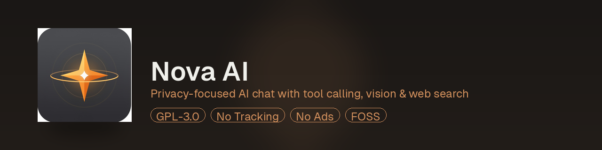

<div align="center">




# Nova AI

### Privacy-focused Android AI chat client with tool calling, vision & web search

[](https://loak7993-code.github.io/nova-ai-fdroid/repo)
[](LICENSE)
[](https://opencode.ai/zen)
[](https://developer.android.com)

A fast, lightweight, open-source AI chat app for Android that connects to [OpenCode Zen](https://opencode.ai/zen) free models out of the box — no API key required. Also works with any OpenAI-compatible API. No tracking. No ads. No telemetry. No proprietary SDKs.

**Multi-model · Streaming · Tool calling · Image vision · Web search · Markdown**

</div>

---

## Features

### Chat
- **Multi-model support** — switch between Big Pickle, DeepSeek V4, MiMo V2.5, Nemotron 3 Ultra, North Mini Code, GLM 5.2, MiniMax M3, and Kimi K2.7 Code on the fly
- **Browse 80+ providers from models.dev** — pick any OpenAI-compatible provider, auto-fill API URL, fetch available models
- **Free models work with no API key** — OpenCode Zen is pre-configured
- **Streaming responses** — answers appear token by token as they generate
- **Collapsible reasoning display** — see the model's thinking process with a tap
- **Conversation history** — persistent chat storage, rename, delete, search
- **Per-message actions** — copy, regenerate, share (AI), copy, edit (user)

### Tool Calling
The AI can autonomously call tools to answer questions:
| Tool | Description | Visible? |
|------|-------------|----------|
| `web_search` | Real web search via self-hosted SearXNG | Shows source badges |
| `calculate` | Math expression evaluator (sqrt, trig, log, etc.) | Silent |
| `get_current_time` | Current date/time | Silent |

### Image Vision
- Attach images from your gallery and ask questions about them
- Supported models: **Big Pickle**, **MiniMax M3**, **Kimi K2.7 Code**
- Auto-prompts to switch to a vision-capable model if needed

### Web Search
- **Self-hosted SearXNG** integration — no API key, no rate limits, no tracking
- Aggregates results from Google, Bing, DuckDuckGo, and Wikipedia
- Smart junk filtering removes dictionary/calendar/irrelevant results
- Source badges show where info came from (up to 3, "+N" if more)

### Markdown Rendering
- Tables with aligned columns
- Fenced code blocks with syntax highlighting
- Headings (H1/H2/H3)
- Bold, italic, inline code
- Bullet lists and numbered lists

### Privacy
- **No tracking** — zero analytics, zero telemetry
- **No ads** — no ad SDKs
- **No proprietary dependencies** — all libraries are Apache 2.0
- **Your API key stays on your device** — stored in SharedPreferences, never transmitted anywhere except the API endpoint you configure
- **No Google Play Services** required

---

## Installation

### Option 1: Install via F-Droid (recommended)

1. Install [F-Droid](https://f-droid.org) on your Android device
2. Open F-Droid → **Settings** → **Repositories**
3. Tap **+** and add this URL:
   ```
   https://loak7993-code.github.io/nova-ai-fdroid/repo
   ```
4. Wait for the repo to sync
5. Search for **Nova AI** and tap **Install**

### Option 2: Download APK directly

1. Go to [releases](https://github.com/loak7993-code/nova-ai/releases)
2. Download the latest `app-release.apk`
3. Enable "Install unknown apps" in Android settings
4. Open the APK file to install

### Option 3: Build from source

```bash
git clone https://github.com/loak7993-code/nova-ai.git
cd nova-ai
./gradlew assembleRelease
```

The APK will be at `app/build/outputs/apk/release/app-release-unsigned.apk`.

---

## Setup Guide

### 1. Start chatting (no setup needed!)

Nova AI comes pre-configured with [OpenCode Zen](https://opencode.ai/zen) free models. Just open the app and start chatting — no API key required.

### 2. (Optional) Browse providers from models.dev

Nova AI can browse 80+ OpenAI-compatible providers from [models.dev](https://models.dev):

1. Open Settings → tap **Providers** next to the API base URL
2. Search and pick a provider (auto-fills the API base URL)
3. Enter your API key
4. Tap **Fetch Models** to load available models from the provider
5. Pick a model from the list

You can also manually enter any OpenAI-compatible API base URL and key.

### 3. (Optional) Use a different provider manually

### 3. Configure Nova AI

1. Open Nova AI
2. Tap the **☰ menu** → **Settings**
3. Enter the **API base URL** from your provider (or keep OpenCode Zen default)
4. Paste your **API key** (leave empty for free Zen models)
5. (Optional) Change the **model**, **system prompt**, or **temperature**
6. Tap **Save**

### 4. (Optional) Enable Web Search

Nova AI uses [SearXNG](https://searxng.org) — a privacy-respecting metasearch engine. You can self-host one or use a public instance.

**Self-host with Docker** (recommended, 2 minutes):
```bash
docker run -d \
  --name searxng \
  --restart unless-stopped \
  -p 8888:8080 \
  searxng/searxng:latest
```

Then in Nova AI → Settings → **Search Engine URL**:
```
http://YOUR_SERVER_IP:8888
```

Or find a public instance at [searx.space](https://searx.space) and use its URL.

**Without SearXNG configured**, web search tool calls will return a helpful message telling the user to set up a SearXNG URL.

---

## Supported Models

| Model | ID | Free? | Vision | Description |
|-------|----|-------|--------|-------------|
| Big Pickle | `big-pickle` | Yes | Yes | General-purpose, vision + reasoning + tools |
| DeepSeek V4 Flash | `deepseek-v4-flash-free` | Yes | No | Fast reasoning + tools |
| MiMo V2.5 | `mimo-v2.5-free` | Yes | No | Reasoning + tools |
| Nemotron 3 Ultra | `nemotron-3-ultra-free` | Yes | No | Reasoning + tools |
| North Mini Code | `north-mini-code-free` | Yes | No | Coding + reasoning + tools |
| GLM 5.2 | `glm-5.2` | No | No | Strong general reasoning, 40B-744B MoE |
| MiniMax M3 | `minimax-m3` | No | Yes | Coding, agentic, vision, 23B-428B MoE |
| Kimi K2.7 Code | `kimi-k2.7-code` | No | Yes | Long-horizon agentic coding, vision, 32B-1T MoE |

Free models run on [OpenCode Zen](https://opencode.ai/zen) with no API key. All models support **tool calling** and **reasoning/thinking** display.

---

## Tech Stack

| Component | Technology |
|-----------|-----------|
| Language | Java 17 |
| Platform | Android (minSdk 24, targetSdk 35) |
| UI | Material Components, custom views |
| HTTP | OkHttp 4.12 |
| JSON | Gson 2.10 |
| Font | Geist (SIL Open Font License) |
| Build | Gradle 8.10, AGP 8.7 |
| Dependencies | AndroidX, Material, OkHttp, Gson — all Apache 2.0 |

**No proprietary SDKs. No Google Play Services. No analytics. No ads.**

---

## Project Structure

```
nova-ai/
├── app/src/main/java/com/nova/ai/
│   ├── MainActivity.java          # Chat screen, message flow
│   ├── SettingsActivity.java      # Settings screen
│   ├── NovaApp.java               # Application init
│   ├── data/
│   │   ├── ChatStorage.java       # Persistent chat history
│   │   ├── Conversation.java       # Conversation model
│   │   ├── Message.java           # Message model (user/AI/tool/error)
│   │   ├── ModelRegistry.java     # Available models
│   │   ├── ModelInfo.java         # Model metadata
│   │   └── Settings.java          # App settings (API key, model, etc.)
│   ├── net/
│   │   └── AiClient.java          # API client, tool calling loop
│   ├── tools/
│   │   └── Tools.java             # Tool implementations (search, calc, time)
│   ├── ui/
│   │   ├── MessageAdapter.java    # Chat message adapter
│   │   ├── ConversationAdapter.java # Drawer conversation list
│   │   └── MarkdownFormatter.java  # Markdown → Spannable renderer
│   └── util/
│       └── ImageLoader.java       # Image load + base64 for vision
├── app/src/main/res/
│   ├── drawable/                  # Icons, backgrounds, shapes
│   ├── font/                      # Geist font (4 weights)
│   ├── layout/                    # All XML layouts
│   ├── values/                    # Colors, strings, themes
│   └── xml/                       # Network security config
├── metadata/
│   └── com.nova.ai.yml            # F-Droid metadata
├── LICENSE                        # GPL-3.0
└── README.md
```

---

## Building

### Prerequisites
- JDK 17
- Android SDK 35 (Platform + Build Tools 35.0.0)
- Gradle 8.10+ (wrapper included)

### Build debug APK
```bash
./gradlew assembleDebug
# Output: app/build/outputs/apk/debug/app-debug.apk
```

### Build release APK
```bash
./gradlew assembleRelease
# Output: app/build/outputs/apk/release/app-release-unsigned.apk
```

### Sign release APK
```bash
keytool -genkey -v -keystore nova.keystore -keyalg RSA -keysize 2048 \
  -validity 10000 -alias nova
jarsigner -verbose -sigalg SHA256withRSA -digestalg SHA-256 \
  -keystore nova.keystore app-release-unsigned.apk nova
zipalign -v 4 app-release-unsigned.apk nova-ai-signed.apk
```

---

## Publishing a New Release

### Update the F-Droid repo
```bash
# Build new APK
cd nova-ai
./gradlew assembleRelease
cp app/build/outputs/apk/release/app-release-unsigned.apk /root/fdroid-repo/repo/com.nova.ai_VERSIONCODE.apk

# Regenerate index
cd /root/fdroid-repo
fdroid update

# Push (auto-deploys via GitHub Actions)
git add -A
git commit -m "Update to vX.X.X"
git push origin main
```

### Tag a release on GitHub
```bash
cd nova-ai
git tag -a vX.X.X -m "Release vX.X.X"
git push origin vX.X.X
```

---

## Privacy & Permissions

| Permission | Why |
|-----------|-----|
| `INTERNET` | Connect to AI API + SearXNG |
| `ACCESS_NETWORK_STATE` | Check connectivity before requests |
| `VIBRATE` | Haptic feedback on actions |

That's it. **No camera, no microphone, no location, no contacts, no storage access beyond file picker.**

Your API key is stored locally on your device using Android's SharedPreferences. It is only sent to the API endpoint you configure — nowhere else.

---

## License

**GPL-3.0-or-later** — see [LICENSE](LICENSE)

Geist font by Vercel is licensed under the [SIL Open Font License](app/src/main/assets/fonts/OFL.txt).

---

## Contributing

1. Fork the repo
2. Create a branch: `git checkout -b feature-name`
3. Commit: `git commit -m "Add feature"`
4. Push: `git push origin feature-name`
5. Open a Pull Request

### Guidelines
- Keep it FOSS — no proprietary dependencies
- No tracking/analytics
- Follow existing code style (Java, no tabs)
- Test builds before submitting

---

## Acknowledgments

- [OpenCode Zen](https://opencode.ai/zen) for the free AI models that power Nova AI out of the box
- [SearXNG](https://searxng.org) for the privacy-respecting search engine
- [Geist](https://vercel.com/font) by Vercel for the beautiful font
- [OkHttp](https://square.github.io/okhttp/) by Square for HTTP
- [F-Droid](https://f-droid.org) for the free software ecosystem

---

<div align="center">

**[Install via F-Droid](https://loak7993-code.github.io/nova-ai-fdroid/repo)** ·
**[Source Code](https://github.com/loak7993-code/nova-ai)** ·
**[Report Issue](https://github.com/loak7993-code/nova-ai/issues)**

Made with care for privacy. No tracking. No ads. Just AI.

</div>
